---
lab:
  title: 'Deploying autonomous AI agents via Azure AI Foundry portal'
  description: 'Learn to configure an autonomous AI agent with Code Interpreter tool capabilities using the Azure AI Foundry web portal.'
  level: 200
  duration: 30
  islab: true
  status: 'released'
---

# Deploying autonomous AI agents via Azure AI Foundry portal

In this exercise, you'll access a pre-provisioned Azure AI Foundry project workspace, confirm model deployment health, and build an autonomous AI agent with Code Interpreter tool capabilities using the Azure AI Foundry web portal.

This exercise should take approximately **30** minutes to complete.

> **Note**: Some of the technologies used in this exercise are in preview or in active development. You may experience some unexpected behavior, warnings, or errors.

## Prerequisites

Before starting this exercise, ensure you have:

- Access to a pre-provisioned Azure AI Foundry project (provided by the lab team)
- A supported web browser (Google Chrome or Microsoft Edge)

## Access the Azure AI Foundry project

1. Open your web browser.

1. Navigate to the Azure AI Foundry portal at `https://ai.azure.com` and sign in using your Azure credentials.

    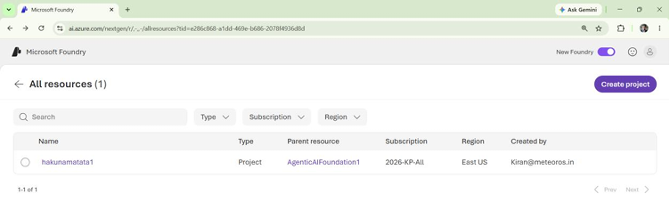

1. Select the Azure AI Foundry project provided by the lab team (for example, `hakunamatata1`).

    The project workspace opens and displays the project dashboard, navigation menu, and available resources.

1. Verify that the project home page displays the API key, project endpoint, Azure OpenAI endpoint, and agent development options.

    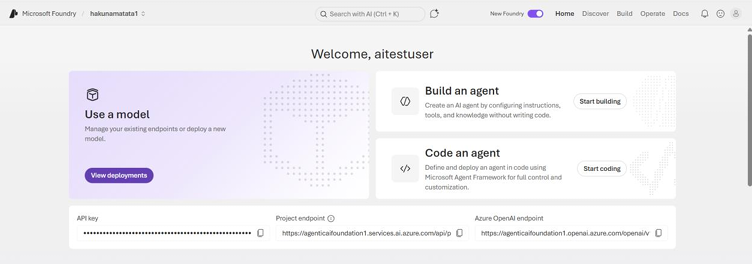

## Verify model deployment

1. On the project home page, select **View deployments**.

    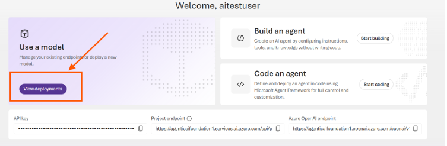

1. Locate the **gpt-5.4-mini** deployment in the deployments list and verify that its status shows **Succeeded**.

    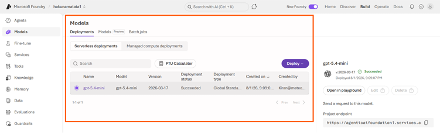

    This confirms the model is available for use before you build an agent against it.

## Create an agent

1. In the left navigation menu, select **Agents**.

    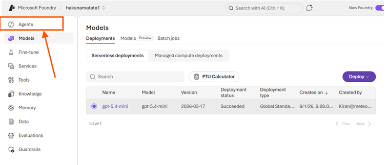

1. Select **New agent**.

    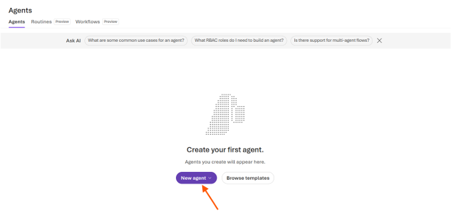

    A dropdown menu displays the available agent creation options: **Build an agent**, **Code an agent**, and **Link external agent**.

1. Select **Build an agent**.

    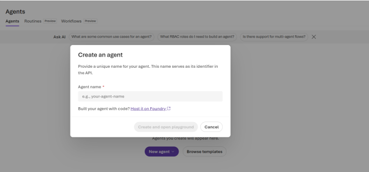

1. In the **Agent name** field, enter:

    ```
    MathTutorAgent-1
    ```

    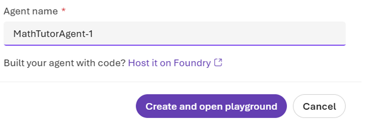

1. Select **Create and open playground**.

    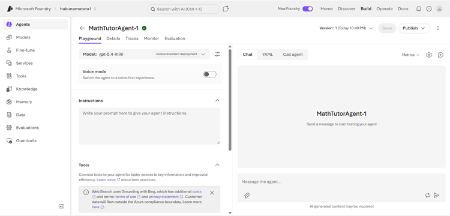

    The agent playground opens, showing the selected model, instructions section, tools section, and an interactive chat interface.

1. Verify that **gpt-5.4-mini** is selected in the **Model** field at the top of the playground.

    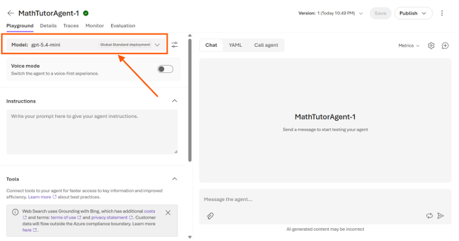

## Configure agent instructions and tools

1. In the **Instructions** section, enter the following prompt:

    ```
    You are a helpful math tutor. Solve problems step-by-step and write Python code to verify the calculation using code interpreter.
    ```

    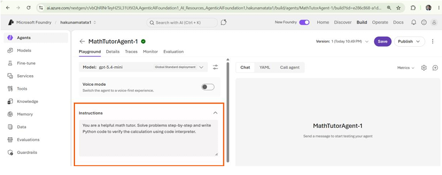

1. In the **Tools** section, select **Add** and enable the **Code Interpreter** tool.

    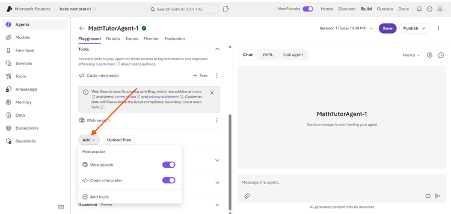

    This allows the agent to execute Python code during conversations.

1. Select **Save** in the top-right corner of the page.

    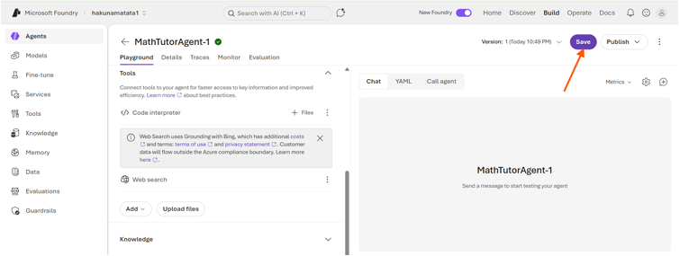

    The agent configuration is saved, and the latest version of the agent is displayed.

## Test the agent in the playground

1. Remain on the **Playground** tab after saving the agent configuration.

1. In the message box, enter the following prompt:

    ```
    Solve this equation: 3x + 7 = 22. Run code to verify the math.
    ```

1. Select **Send**.

    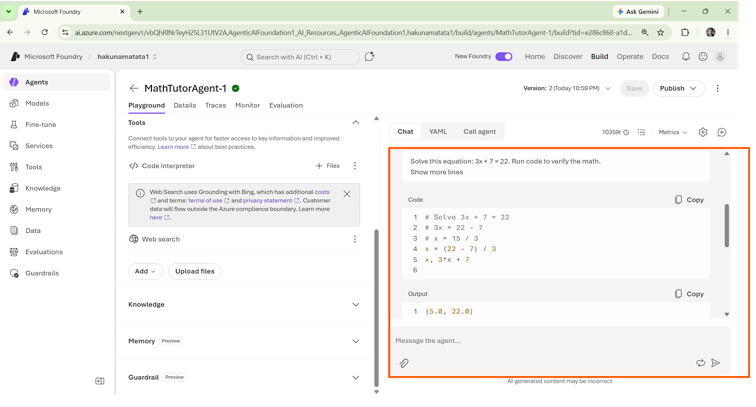

    The agent uses the Code Interpreter tool to execute Python code and returns the correct solution, confirming that x = 5, with Python verification showing `3 * 5.0 + 7 = 22.0`.

## Validation checkpoints

1. Open the **Agents** page from the left navigation menu and confirm that **MathTutorAgent-1** appears in the agents list.

1. In the Playground chat, review the generated response and confirm it displays:
    - The Python code used to solve the equation
    - The code execution output
    - The final answer (x = 5)

    This confirms that the Code Interpreter tool is working correctly.

## Clean up

1. Open the **Agents** page from the left navigation menu.

1. Select **MathTutorAgent-1** from the agents list, select **Delete**, and confirm the deletion.

1. Clear the current conversation or start a new chat session from the Playground.

1. Select the profile icon in the top-right corner and select **Sign out**.