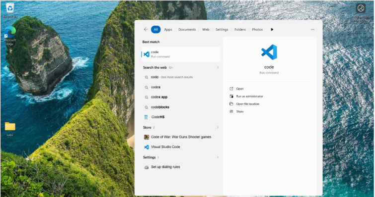
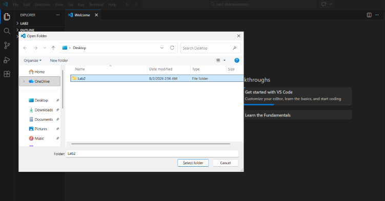
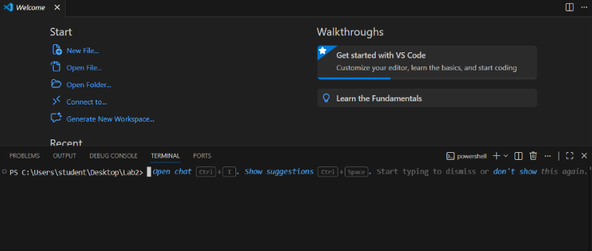
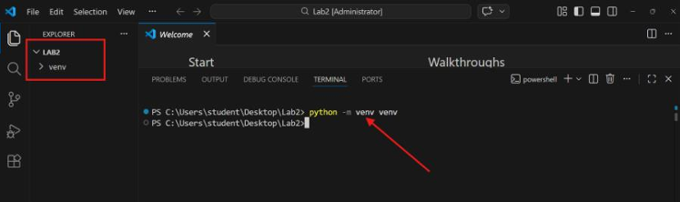
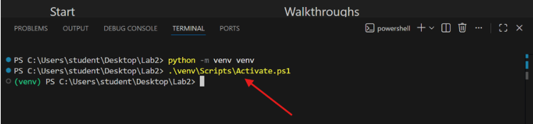
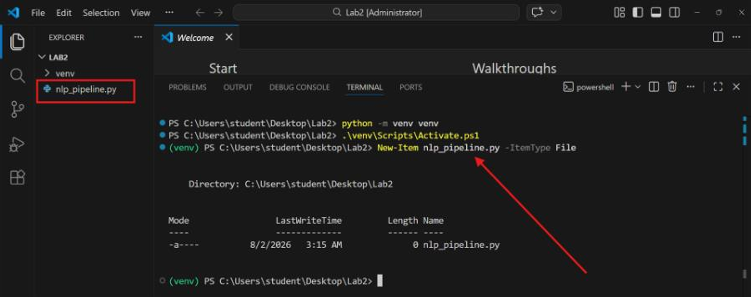
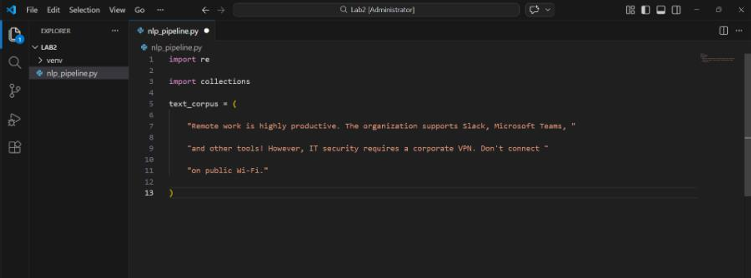

---
lab:
  title: 'Introduction to Natural Language Processing and Subword Tokenization'
  description: 'Build a lightweight, package-free NLP pipeline in Python covering sentence segmentation, tokenization, noise filtering, and Byte Pair Encoding.'
  level: 200
  duration: 45
  islab: true
  status: 'released'
---

# Introduction to Natural Language Processing and Subword Tokenization

In this exercise, you'll create a lightweight, package-free Natural Language Processing (NLP) pipeline in Python. You'll implement sentence segmentation, word tokenization, noise filtering, and a custom Byte Pair Encoding (BPE) subword vocabulary merge loop, with detailed analysis of the underlying computational mechanics.

This exercise should take approximately **45** minutes to complete.

> **Note**: This lab demonstrates the primary cleaning and slicing operations required to convert raw text into token structures consumable by large language models, using only Python's standard library.

## Prerequisites

Before starting this exercise, ensure you have:

- [Python 3.10+](https://www.python.org/downloads/) installed
- [Visual Studio Code](https://code.visualstudio.com/) installed

## Create the lab folder and open VS Code

1. Right-click on the Desktop and select **New** > **Folder**. Name the folder `Lab2`.

1. Click the Windows **Start** button, type `Code` in the search bar, and select the **VS Code** application from the results.

1. In VS Code, select **File** > **Open Folder** and open the `Lab2` folder. Alternatively, press **Ctrl + K**, then **Ctrl + O**, select the `Lab2` folder, and select **Select Folder**.

    

    The `Lab2` folder opens in Visual Studio Code and is displayed in the Explorer pane. The title bar also updates to show "Lab2" as the open workspace.

    

## Open the integrated terminal

1. From the top menu, select **Terminal** > **New Terminal**, or press **Ctrl + Shift + `**.

    

    An integrated terminal opens at the bottom of the VS Code window, with the prompt showing the current path ending in `\Lab2`.

## Initialize a Python virtual environment

1. In the terminal, run:

    ```
    python -m venv venv
    ```

    

    A virtual environment folder named `venv` is created inside the `Lab2` directory, containing subfolders such as `Scripts` (or `bin` on macOS/Linux), `Lib`, and a `pyvenv.cfg` file.

## Activate the virtual environment

1. In the terminal, run:

    ```
    .\venv\Scripts\Activate.ps1
    ```

    

    The virtual environment is activated, and the terminal prompt displays `(venv)` before the current directory path, confirming any package installs or script runs stay isolated to this project.

## Create the NLP pipeline script file

1. In the terminal, run:

    ```
    New-Item nlp_pipeline.py -ItemType File
    ```

    

    A new file named `nlp_pipeline.py` is created inside the `Lab2` folder. The file starts out empty (0 bytes), which is expected at this point.

## Configure script headers and raw corpus

1. Double-click `nlp_pipeline.py` in the VS Code Explorer pane to open it, and add the following code:

    ```python
    import re            # lets us split and search text using patterns
    import collections   # gives us defaultdict, handy for counting things later

    text_corpus = (  # the raw block of text this whole script works on
        "Remote work is highly productive. The organization supports Slack, Microsoft Teams, "
        "and other tools! However, IT security requires a corporate VPN. Don't connect "
        "on public Wi-Fi."
    )
    ```

    

    The required import statements and sample text corpus are added to the script with no errors shown in the editor. Since nothing is printed yet at this stage, running the file now would do nothing visible, which is expected before the next step adds the first print statement.

## Implement sentence segmentation

1. Add the following code:

    ```python
    print("Part 1: Sentence Segmentation")
    sentences = re.split(r'(?<=[.!?])\s+', text_corpus)  # split after . ! or ? followed by a space, keeping the punctuation attached
    for idx, sentence in enumerate(sentences):
        print(f"Sentence {idx+1}: {sentence}")
    ```

    Running the script at this point prints exactly 4 sentences:
    - Sentence 1: Remote work is highly productive.
    - Sentence 2: The organization supports Slack, Microsoft Teams, and other tools!
    - Sentence 3: However, IT security requires a corporate VPN.
    - Sentence 4: Don't connect on public Wi-Fi.

## Configure word tokenization

1. Add the following code:

    ```python
    print("\nPart 2: Word Tokenization")
    target_sentence = sentences  # pick sentence 2 (index 1) to run tokenization tests on[1]
    print(f"Target: '{target_sentence}'")
    naive_tokens = target_sentence.split()  # the simplest possible tokenizer: just split on whitespace
    print(f"Naive Tokens ({len(naive_tokens)}): {naive_tokens}")
    ```

    With sentence 2 selected, this naive split produces 9 tokens, and punctuation like commas or exclamation marks stay glued to the words next to them (for example, `'Slack,'` and `'tools!'`).

## Implement regex word tokenization

1. Add the following code:

    ```python
    regex_tokens = re.findall(r"\w+(?:'\w+)?|[.!?,]", target_sentence)  # grabs words (keeping contractions like don't whole) and punctuation as separate tokens
    print(f"Regex Tokens ({len(regex_tokens)}): {regex_tokens}")
    ```

    Words and punctuation are extracted as separate tokens this time. The same target sentence now produces 12 tokens, since the commas and exclamation mark each become their own token.

## Configure stopword removal and normalization

1. Add the following code:

    ```python
    print("\nPart 3: Normalization & Stopword Removal")
    stopwords = {"is", "and", "other", "a", "on"}  # small, common words we don't care about for this exercise
    normalized_tokens = [token.lower() for token in regex_tokens]  # lowercase everything so 'The' and 'the' count as the same word
    cleaned_tokens = [
        token for token in normalized_tokens
        if token not in stopwords and token.isalnum()  # drop stopwords and drop anything that isn't purely letters/numbers
    ]
    print(f"Original Regex Tokens: {regex_tokens}")
    print(f"Cleaned Tokens: {cleaned_tokens}")
    ```

    The cleaned output for this sentence comes out to:

    ```
    ['the', 'organization', 'supports', 'slack', 'microsoft', 'teams', 'tools']
    ```

    Stopwords and punctuation are removed since they fail the stopword check or the `isalnum()` check.

## Configure the BPE initial vocabulary

1. Add the following code:

    ```python
    print("\nPart 4: Byte Pair Encoding (BPE) Concept")
    word_corpus = [  # each word broken into single characters, with </w> marking the end of the word
        "l o o k </w>",
        "l o o k s </w>",
        "l o o k i n g </w>",
        "c o o k </w>"
    ]
    print(f"Initial Vocabulary: {word_corpus}")
    ```

    This is the starting point before any merges happen, four words spelled out as space-separated characters ending in the `</w>` marker.

## Implement BPE pair frequency statistics

1. Add the following code:

    ```python
    def get_pair_statistics(corpus):
        # counts how often every neighboring pair of symbols shows up across all words
        pairs = collections.defaultdict(int)  # stores pair frequencies
        for word in corpus:
            symbols = word.split()  # break the word back into its individual symbols
            for i in range(len(symbols) - 1):  # walk through the word one pair at a time
                pairs[(symbols[i], symbols[i + 1])] += 1  # tally this pair
        return pairs
    ```

    The function calculates adjacent character pair frequencies but produces no printed output on its own, since defining a function doesn't run it.

## Implement BPE merge replacement logic

1. Add the following code:

    ```python
    def merge_character_pair(pair, corpus):
        # takes the winning pair and glues it together everywhere it appears
        merged_corpus = []
        bigram = ' '.join(pair)        # rebuild the pair as it currently looks, e.g. 'o o'
        merged_str = ''.join(pair)     # and how it should look after merging, e.g. 'oo'
        pattern = re.compile(r'(?<!\S)' + re.escape(bigram) + r'(?!\S)')
        for word in corpus:
            new_word = pattern.sub(merged_str, word)
            merged_corpus.append(new_word)
        return merged_corpus
    ```

    This function only does something once it's called, which happens in the next step.

## Implement the BPE merge loop

1. Add the following code:

    ```python
    num_merges = 3
    for i in range(num_merges):
        pair_stats = get_pair_statistics(word_corpus)
        if not pair_stats:
            break
        best_pair = max(pair_stats, key=pair_stats.get)
        word_corpus = merge_character_pair(best_pair, word_corpus)
        print(f"Iteration {i+1}: merges {best_pair}, frequency {pair_stats[best_pair]} -> {word_corpus}")
    ```

    Running this loop produces three merge iterations:
    - Iteration 1: merges ('o', 'o'), frequency 4 -> ['l oo k </w>', 'l oo k s </w>', 'l oo k i n g </w>', 'c oo k </w>']
    - Iteration 2: merges ('oo', 'k'), frequency 4 -> ['l ook </w>', 'l ook s </w>', 'l ook i n g </w>', 'c ook </w>']
    - Iteration 3: merges ('l', 'ook'), frequency 3 -> ['look </w>', 'look s </w>', 'look i n g </w>', 'c ook </w>']

    By the third merge, "look" has fully formed as a single unit in three of the four words.

## Run the NLP pipeline script

1. In the terminal, run:

    ```
    python nlp_pipeline.py
    ```

    The script executes successfully and displays, in order: sentence segmentation results (4 sentences), naive tokenization output (9 tokens), regex tokenization output (12 tokens), normalized and filtered tokens (7 cleaned tokens), and the BPE merge iterations ending with "look" fully merged.

## Validation checkpoints

1. Verify pipeline output logs by running:

    ```
    python nlp_pipeline.py
    ```

    The script runs successfully and displays all four sections in order, with no tracebacks or error messages.

1. Verify the sentence count by running:

    ```
    python -c "import re; corpus='Remote work is highly productive. The organization supports Slack, Microsoft Teams, and other tools! However, IT security requires a corporate VPN. Don''t connect on public Wi-Fi.'; print(len(re.split(r'(?<=[.!?])\s+', corpus)))"
    ```

    This returns `4`, confirming the corpus splits into exactly four sentences.

1. Verify the BPE subword merge output by running:

    ```
    python -c "import re, collections; from nlp_pipeline import merge_character_pair; corpus=['l o o k </w>']; p=('o','o'); print(merge_character_pair(p, corpus))"
    ```

    This returns `l oo k </w>`, confirming the merge function correctly glues a single `('o', 'o')` pair together on an isolated test word.

## Clean up

1. Deactivate the virtual environment:

    ```
    deactivate
    ```

    The `(venv)` prefix is removed from the terminal prompt, confirming the shell has returned to the system-wide Python environment.

1. Navigate out of the lab folder:

    ```
    cd ..
    ```

1. Delete the `Lab2` folder using File Explorer.

    The `Lab2` folder and its contents, including the `venv` environment and `nlp_pipeline.py`, are removed from the system.